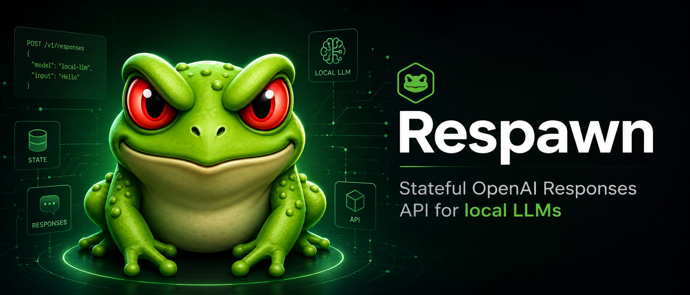

Respawn is a local OpenAI-shaped API gateway for self-hosted LLM backends.

It exposes a familiar `/v1` surface for OpenAI SDKs, stores Responses state,
reconstructs `previous_response_id` chains, normalizes streaming events, and
forwards generation to a configured model backend. The default Docker stack uses
Ollama, Postgres, VictoriaMetrics, and Grafana.

Respawn is an API gateway, not an inference runtime. It does not load models,
schedule GPU work, batch tokens, quantize weights, or manage KV cache. Those
jobs belong to the model backend underneath it.

## Highlights

- OpenAI-compatible `/v1/responses` gateway for local model backends.
- Blocking, streaming, background, retrieve, delete, cancel, and input-item
  Responses flows.
- Stateful `previous_response_id` reconstruction stored in Postgres or SQLite.
- Responses function/custom tool protocol support without local tool execution.
- Opt-in local Responses `web_search` through mock or SearXNG providers.
- Opt-in local Responses `image_generation` through ComfyUI, with Automatic1111 kept as a legacy backend option.
- Local Files API subset and file/image input normalization.
- Local prompt templates, prompt-cache accounting, reasoning items, and context
  compaction/truncation.
- OpenAI-shaped errors, request IDs, idempotency keys, and tenant scoping.
- `/v1/chat/completions` compatibility wrapper.
- Prometheus metrics, structured JSON logs, readiness checks, and a provisioned
  Grafana dashboard.
- Real-backend benchmark suite with compatibility coverage gates.

## Why Respawn?

Ollama, vLLM, and similar servers are inference backends: they are good at
loading models and generating tokens. Respawn is the compatibility and
operations layer in front of that backend. Use it when your application expects
OpenAI-style Responses behavior, state, SDK ergonomics, and production signals
instead of a thin model generation endpoint.

Direct Ollama is often enough for simple prompts. Respawn becomes useful when
you need the backend to behave like a local OpenAI-shaped platform:

| Need | Direct backend API | With Respawn |
| --- | --- | --- |
| OpenAI Responses endpoint | Ollama exposes an OpenAI-like Chat Completions API, not full `/v1/responses`. | `POST /v1/responses` with blocking, streaming, background, retrieve, delete, cancel, and input-item flows. |
| Conversation continuity | The client usually has to resend or rebuild history. | `previous_response_id` chains are stored and reconstructed server-side. |
| Stored response objects | Generation results are transient unless the client stores them. | Responses, input items, artifacts, and metadata can be persisted locally. |
| OpenAI SDK behavior | Compatibility depends on the specific backend surface. | The official OpenAI Python SDK can target Respawn's `/v1` base URL. |
| Streaming event shape | Backend-native streams vary by provider. | Streams are normalized into Responses lifecycle events. |
| Background jobs | Usually not provided as OpenAI-shaped response lifecycle state. | `background=true`, polling, terminal retrieval, cancellation, and metrics are implemented locally. |
| File and image inputs | Backend-specific handling and error behavior. | Local Files API subset, file extraction, artifact records, and vision capability checks. |
| Tool protocol | Backend support varies and may be chat-shaped. | Responses function-call and custom-tool-call items, including namespace-wrapped function/custom tools, are validated, stored, replayed, and streamed as protocol data. |
| Web search | Hosted providers execute search internally. | Optional local `web_search` runs through a configured provider, emits `web_search_call`, and adds URL citations. |
| Image generation | Hosted providers execute image tools internally. | Optional local `image_generation` runs through a configured ComfyUI or Automatic1111-compatible provider and emits `image_generation_call` with a base64 PNG. |
| Context planning | Mostly a client concern. | Local token estimates, truncation, compaction, and prompt-cache accounting. |
| Errors and request IDs | Backend-specific error payloads. | OpenAI-shaped errors, stable request IDs, idempotency handling, and tenant scoping. |
| Operations | Backend metrics only, often model-runtime focused. | Prometheus metrics, structured logs, readiness checks, backend/model labels, and Grafana dashboards. |
| Release confidence | Manual probing. | Real-backend benchmark suite plus compatibility coverage gates. |

Respawn does not make the model itself smarter or faster. It makes local
inference easier to integrate, observe, test, and swap behind an API contract.
The same gateway model can apply to future backends such as vLLM once an
adapter is implemented.

## Current Scope

Respawn currently targets one gateway instance connected to one configured model
backend. The mock backend is for tests and smoke checks; production-like local
runs should use `MODEL_BACKEND=ollama` or another explicitly integrated backend.

Supported and unsupported behavior is tracked in:

- [docs/COMPATIBILITY.md](docs/COMPATIBILITY.md)
- `GET /compatibility/responses`

Current manifest summary:

| Tracked features | Supported or conditional | Explicitly unsupported |
| ---: | ---: | ---: |
| 130 | 123 | 7 |

Respawn deliberately does not implement the OpenAI Conversations API, browser
actions, hosted tool execution beyond opt-in local query-style `web_search` and
SD1.5-backed text-to-image `image_generation`, audio/realtime APIs, distributed
prompt caches, dynamic backend routing, or multi-replica consistency.

## Quick Start With Docker

The easiest path starts the full local stack:

```bash
cd infra/docker
make env
make up-build
make ready
```

Services:

| Service | URL |
| --- | --- |
| Respawn | `http://localhost:8080` |
| Grafana | `http://localhost:3000` |
| VictoriaMetrics | `http://localhost:8428` |
| Ollama OpenAI API | `http://localhost:11434/v1` |

Default Grafana login:

```text
admin / respawn
```

The default Compose environment preloads:

- `gpt-oss:120b` for text/reasoning/tools/file-text scenarios.
- `moondream:latest` for vision smoke tests.

If you already have Ollama models on the host, set `OLLAMA_MODELS_PATH` in
`infra/docker/env` before starting the stack:

```text
OLLAMA_MODELS_PATH=/usr/share/ollama/.ollama
```

Useful Docker commands:

```bash
cd infra/docker
make ps
make logs-respawn
make models
make metrics
make grafana
make down
```

## Use With The OpenAI Python SDK

```python
from openai import OpenAI

client = OpenAI(
    base_url="http://localhost:8080/v1",
    api_key="local-dev-key",
)

response = client.responses.create(
    model="gpt-oss:120b",
    input="Explain Kubernetes in one sentence.",
)

print(response.output_text)
```

Streaming:

```python
from openai import OpenAI

client = OpenAI(base_url="http://localhost:8080/v1", api_key="local-dev-key")

with client.responses.stream(
    model="gpt-oss:120b",
    input="Write a short haiku about local inference.",
) as stream:
    for event in stream:
        if event.type == "response.output_text.delta":
            print(event.delta, end="")
```

Background response:

```python
created = client.responses.create(
    model="gpt-oss:120b",
    input="Summarize the tradeoffs of local LLM gateways.",
    background=True,
    store=True,
)

retrieved = client.responses.retrieve(created.id)
```

## Local Development

Install the gateway in editable mode:

```bash
cd apps/gateway
python3 -m venv .venv
. .venv/bin/activate
pip install -e ".[test]"
```

Run against a local Ollama process:

```bash
ollama serve
ollama pull gpt-oss:120b

MODEL_BACKEND=ollama \
OLLAMA_BASE_URL=http://localhost:11434/v1 \
DEFAULT_MODEL=gpt-oss:120b \
uvicorn src.main:app --host 0.0.0.0 --port 8080
```

Run without a model backend by using the deterministic mock backend:

```bash
MODEL_BACKEND=mock \
DEFAULT_MODEL=gpt-oss-120b \
uvicorn src.main:app --host 0.0.0.0 --port 8080
```

Default local development behavior:

| Variable | Default |
| --- | --- |
| `MODEL_BACKEND` | `ollama` |
| `DEFAULT_MODEL` | `gpt-oss:120b` |
| `AUTH_DISABLED` | `true` |
| `LOCAL_OPENAI_API_KEYS` | `local-dev-key:tenant-local` |
| `DATABASE_URL` | `sqlite+aiosqlite:///./gateway.db` |
| `AUTO_CREATE_TABLES` | `true` |

Run tests:

```bash
cd apps/gateway
.venv/bin/python -m pytest
```

Run migrations explicitly:

```bash
cd apps/gateway
DATABASE_URL=sqlite+aiosqlite:///./gateway.db alembic upgrade head
```

## API Surface

Core endpoints:

| Endpoint | Purpose |
| --- | --- |
| `POST /v1/responses` | Create blocking, streaming, or background Responses. |
| `GET /v1/responses/{response_id}` | Retrieve stored Responses. |
| `DELETE /v1/responses/{response_id}` | Soft-delete stored Responses. |
| `GET /v1/responses/{response_id}/input_items` | List stored input items. |
| `GET /v1/responses/{response_id}/artifacts` | List local response artifacts. |
| `GET /v1/responses/{response_id}/artifacts/{artifact_id}/content` | Download local artifact text content. |
| `POST /v1/responses/{response_id}/cancel` | Cancel background Responses. |
| `POST /v1/responses/input_tokens` | Estimate input tokens with local context planning. |
| `POST /v1/responses/compact` | Run stateless local context compaction. |
| `POST /v1/responses/prompts` | Create a local prompt template. |
| `GET /v1/responses/prompts` | List local prompt templates. |
| `GET /v1/responses/prompts/{id}` | Retrieve a local prompt template. |
| `DELETE /v1/responses/prompts/{id}` | Delete a local prompt template version. |
| `DELETE /v1/responses/prompt_cache` | Clear local prompt-cache entries. |
| `POST /v1/files` | Upload local platform files. |
| `GET /v1/files` | List local platform files. |
| `GET /v1/files/{file_id}` | Retrieve local file metadata. |
| `GET /v1/files/{file_id}/content` | Download local file bytes. |
| `DELETE /v1/files/{file_id}` | Delete local files. |
| `POST /v1/chat/completions` | Chat Completions compatibility wrapper. |
| `GET /v1/models` | List configured backend models. |
| `GET /compatibility/responses` | Return the machine-readable compatibility manifest. |
| `GET /healthz` | Liveness. |
| `GET /readyz` | Readiness. |
| `GET /metrics` | Prometheus metrics. |

Example `POST /v1/responses` payload:

```json
{
  "model": "gpt-oss:120b",
  "input": "string or list of input items",
  "instructions": "optional system instructions",
  "previous_response_id": "resp_...",
  "store": true,
  "stream": false,
  "background": false,
  "temperature": 0.7,
  "top_p": 1,
  "max_output_tokens": 1024,
  "reasoning": {"effort": "low", "summary": "auto"},
  "prompt_cache_key": "tenant-or-workload",
  "prompt_cache_retention": "in_memory",
  "text": {"format": {"type": "text"}},
  "metadata": {}
}
```

## Responses Features

### Stateful Responses

Respawn implements `previous_response_id` in the gateway. When a request points
at a prior stored response, Respawn loads the response chain, validates tenant
access and deletion state, reconstructs chat history, appends the new input, and
sends the full context to the backend.

### Streaming

Responses streaming uses Server-Sent Events with OpenAI-shaped lifecycle events,
stable SSE IDs, sequence numbers, text deltas, failure events, incomplete
events, and function-call argument deltas.

### Background Jobs

`background=true` creates a stored pollable response and returns quickly. Jobs
are local to the current Respawn process and configured backend. Background mode
requires `store=true`.

### Tool Calling

Respawn supports the Responses function/custom tool protocol:

1. Clients send `type=function` tool definitions.
2. The model may emit `function_call` output items.
3. Clients execute functions themselves.
4. Clients submit `function_call_output` input items in a follow-up request.

For `type=custom`, Respawn maps the free-form custom tool to the local backend's
function-call shape, emits `custom_tool_call`, stores/replays the item, and
accepts `custom_tool_call_output` in follow-up requests. Respawn never executes
function or custom tools. Query-style `web_search` and
text-to-image `image_generation` are available only when explicitly enabled and
configured. Hosted tools, shell, filesystem, git, workspace, browser, code
interpreter, MCP hosting, and similar execution surfaces are explicitly out of
scope.

### Multimodal And Files

Respawn supports model-capability-aware `input_image` and local `input_file`
parts. Files can be uploaded through the local Files API, resolved by
`file_id`, text-extracted where supported, stored with tenant scope, and cited in
local response artifacts.

Audio input is deliberately unsupported.

### Prompt Templates And Prompt Cache

Local prompt templates are managed through `/v1/responses/prompts` and rendered
before context planning and backend calls. Template variables use `{{name}}`
placeholders.

Prompt-cache accounting is local single-process prefix accounting. It reports
`usage.input_tokens_details.cached_tokens`, but it does not reuse backend KV
tensors or skip model prefill.

### Reasoning

Respawn accepts Responses `reasoning` settings and maps effort to backend
capabilities when available. Ollama `thinking` output can be tracked as
reasoning tokens and returned as a local reasoning item. Summary text is
high-level local metadata and does not expose raw chain-of-thought.

## Observability

Respawn emits:

- Structured JSON request logs, with full model input/output payloads available
  at `LOG_LEVEL=DEBUG`.
- `x-request-id` headers.
- HTTP, endpoint, feature-family, error, latency, and in-flight metrics.
- Responses metrics by model, mode, status, and storage behavior.
- Backend metrics by backend, model, operation, and status.
- Backend-native prefill/decode throughput metrics.
- Readiness metrics for database, backend, worker, cache, and storage.
- Background job, streaming, prompt-cache, context, include, file-storage, and
  operational-failure metrics.

The Compose stack provisions VictoriaMetrics and a Grafana dashboard named
`Respawn Model Gateway`. The dashboard has `$llm_backend` and `$model` variables
so the same panels can work for Ollama today and future backends.

See [docs/OPERATIONS.md](docs/OPERATIONS.md) for readiness behavior, failure
drills, benchmark history comparison, and release certification.

## Benchmarks And Compatibility Gate

The benchmark suite calls Respawn over HTTP and validates feature behavior,
latency, compatibility coverage, SDK contract paths, metrics, and operations
drills.

Run the full real Ollama-backed release gate:

```bash
cd infra/docker
make benchmark-real
```

This target forces `MODEL_BACKEND=ollama`, clears tag include/exclude filters,
keeps the compatibility coverage gate enabled, expects Ollama metrics, and
writes `benchmark-results/respawn-benchmark-real.json`.

Run the configurable real benchmark target when you intentionally want to pass
tag filters or custom comparison settings:

```bash
cd infra/docker
make benchmark
```

Run deterministic smoke mode with the mock backend:

```bash
cd infra/docker
make benchmark-mock
```

Focused benchmark examples:

```bash
cd infra/docker
RESPAWN_BENCHMARK_INCLUDE_TAGS=streaming make benchmark
RESPAWN_BENCHMARK_INCLUDE_TAGS=observability make benchmark
RESPAWN_BENCHMARK_EXCLUDE_TAGS=reasoning make benchmark
RESPAWN_BENCHMARK_COMPARE_TO=/results/respawn-benchmark-previous.json make benchmark
make benchmark-real REAL_BENCHMARK_RUNS=1
```

Reports are written to `infra/docker/benchmark-results/`.

## Configuration

Most local defaults live in [infra/docker/env.example](infra/docker/env.example).
Create machine-local overrides with:

```bash
cd infra/docker
make env
```

Important variables:

| Variable | Purpose |
| --- | --- |
| `MODEL_BACKEND` | Backend adapter: `ollama` or `mock`. |
| `OLLAMA_BASE_URL` | Ollama OpenAI-compatible base URL. |
| `DEFAULT_MODEL` | Model used when requests omit `model`. |
| `MODEL_CAPABILITIES` | Per-model capability map for validation. |
| `DATABASE_URL` | SQLAlchemy async database URL. |
| `AUTH_DISABLED` | Disable bearer-token auth for local development. |
| `LOCAL_OPENAI_API_KEYS` | Comma-separated `key:tenant` mappings. |
| `STORE_DEFAULT` | Default Responses storage behavior. |
| `MAX_CHAIN_DEPTH` | Maximum `previous_response_id` chain depth. |
| `CONTEXT_WINDOW_DEFAULT_TOKENS` | Default model context window used for local truncation and model metadata. |
| `MODEL_CONTEXT_WINDOWS` | Per-model context windows exposed by `/v1/models`, for example `gpt-oss:120b=131072`. |
| `BACKEND_TIMEOUT_SECONDS` | Backend HTTP timeout. |
| `BACKGROUND_JOB_TIMEOUT_SECONDS` | Background job timeout. |
| `LOG_LEVEL` | Gateway log level: `INFO` by default, `DEBUG` for model request/response payloads, `TRACE` for metrics request logs and very-verbose streaming chunks. |
| `PROMPT_CACHE_*` | Local prompt-cache accounting settings. |
| `FILE_STORAGE_BACKEND` | File blob storage backend. |
| `FILE_STORAGE_PATH` | Filesystem storage path when enabled. |
| `IMAGE_GENERATION_BACKEND` | Optional image backend: `comfyui`, `automatic1111`, or `mock`. |
| `IMAGE_GENERATION_BASE_URL` | Image backend HTTP base URL. |
| `GRAFANA_*` | Local Grafana settings. |
| `RESPAWN_BENCHMARK_*` | Benchmark runner configuration. |

## Repository Layout

```text
apps/gateway/
  src/
    api/                 FastAPI routes
    adapters/            Backend adapters
    observability/       Logging and Prometheus metrics
    schemas/             Request, response, and error models
    security/            API-key auth and tenant resolution
    services/            Response orchestration and compatibility logic
    storage/             SQLAlchemy models, repository, Alembic migrations
    streaming/           SSE event rendering
  tests/                 Unit, integration, streaming, contract tests
  Dockerfile
  alembic.ini
  pyproject.toml

docs/
  COMPATIBILITY.md       Human-readable compatibility matrix
  OPERATIONS.md          Operations, readiness, metrics, release checks

infra/docker/
  docker-compose.yml
  docker-compose.benchmark.yml
  docker-compose.benchmark.mock.yml
  env.example
  benchmark/
  observability/
```

## Development Checks

```bash
cd apps/gateway
.venv/bin/python -m pytest
```

```bash
cd infra/docker
docker compose -f docker-compose.yml config
make benchmark-mock
```

Automated coverage includes request validation, OpenAI-shaped errors, auth and
tenant isolation, response-chain reconstruction, soft delete behavior,
structured-output repair, streaming event formatting, function/custom-tool protocol
flows, file/image normalization, Ollama adapter behavior, metrics, readiness,
and OpenAI Python SDK contract checks.

## License

MIT. See [LICENSE](LICENSE).
